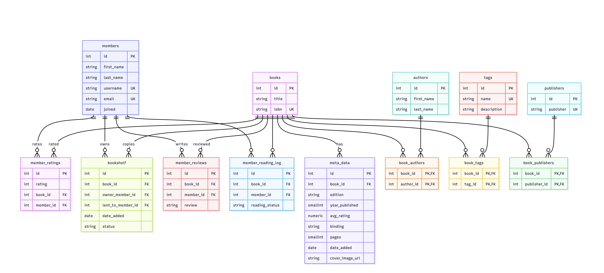

# README AND DESIGN DOCUMENT

By Elisa Bennett

Video overview link: [Video Recording](https://youtu.be/1NTrNEd1Wa4)

## Scope

The database `community_books_db` includes all the entities necessary to faciliate the process of tracking books owned by various community members, books availble to borrow, community feedback on books via reviews and ratings as well as larger feedback on the books from avg ratings provided by the larger global community via Goodreads.  As such, included in the database's scope is:

* Books, including basic identifying information such as the title and isbn
* Authors, including the first and last name
* Publishers, which is a list of publisher names
* Book meta data, including the year published, avg_rating, pages, binding type, date added and book edition
* Bookshelf is where books owned by different members are availble for checkout to other members
* Members, including ways to indentify the member by first and last name as well as a username
* Member reviews, which provides reviews from the community on books
* Member ratings, which provides ratings from the community on books they want to rate
* Member reading log including what members are reading which books

## Functional Requirements

This databse will support:

* CRUD operations for members
* Tracking all books owned by members
* Tracking all information related to a particular book
* Adding multiple member reviews of books within the catalog of books
* Adding addition tags to classify books under different labels

### Design Decisions

This database schema was designed to support a shared community book library while maintaining data integrity, flexibility, and efficient querying. Books are modeled separately from ownership using the bookshelf table to distinguish between the shared book catalog and the physical copies owned by individual members, allowing multiple members to own or lend the same book without duplicating book data.

Many-to-many relationships—such as books and authors, tags, and publishers—are represented through join tables to preserve normalization and enable flexible categorization. Member interactions, including reviews, ratings, and reading status, are stored in separate tables so each type of engagement can evolve independently. Referential integrity is enforced through foreign key constraints and targeted cascading deletes, ensuring dependent records are cleaned up appropriately while shared reference data remains intact. A tigger is used to maintain an audit log of members who edit the community, perserving the historical context even after a member is deleted. Indexes were added based on common query patterns, such as searching by username, author name, book title, and availability, to balance performance with maintainability.

### Representation

Entities are captured in Postgresql tables with the following schema.

### Entities

The database includes the following entities:

#### Books

The `books` table includes:

* `id`, which specifies the unique ID for the book as an INTEGER. This column thus has the PRIMARY KEY constraint applied.
* `title`, which is the book’s title as VARCHAR(255). This column is NOT NULL.
* `isbn`, which is the book’s ISBN as VARCHAR(17). This column has a UNIQUE constraint applied, ensuring no two books share the same ISBN (while still allowing NULL values).


#### Authors

The `authors` table includes:

* `id`, which specifies the unique ID for the author as an INTEGER. This column thus has the PRIMARY KEY constraint applied.
* `first_name`, which is the author’s first name as VARCHAR(255). This column is NOT NULL.
* `last_name`, which is the author’s last name as VARCHAR(255). This column is NOT NULL.

#### Book Authors

The `book_authors` table includes:

* `book_id`, which is an INTEGER identifying the book. This column is NOT NULL and has a FOREIGN KEY constraint referencing books(id) with ON DELETE CASCADE.
* `author_id`, which is an INTEGER identifying the author. This column is NOT NULL and has a FOREIGN KEY constraint referencing authors(id) with ON DELETE CASCADE.
* A composite PRIMARY KEY (book_id, author_id), which ensures each book–author pairing appears at most once and models the many-to-many relationship between books and authors.

#### Publishers

The `publishers` table includes:

* `id`, which specifies the unique ID for the publisher as an INTEGER. This column thus has the PRIMARY KEY constraint applied.
* `publisher`, which is the publisher’s name as VARCHAR(255). This column has a UNIQUE constraint applied.

#### Book Publishers

The `book_publishers` table includes:

* `book_id`, which is an INTEGER identifying the book. This column has a FOREIGN KEY constraint referencing books(id) with ON DELETE CASCADE.
* `publisher_id`, which is an INTEGER identifying the publisher. This column has a FOREIGN KEY constraint referencing publishers(id) with ON DELETE CASCADE.
* A composite PRIMARY KEY (book_id, publisher_id), which ensures each book–publisher pairing appears at most once and models the many-to-many relationship between books and publishers.

#### Meta Data

The `meta_data` table includes:

* `id`, which specifies the unique ID for the metadata record as an INTEGER. This column thus has the PRIMARY KEY constraint applied.
* `book_id`, which is an INTEGER identifying the book this metadata belongs to. This column is NOT NULL and has a FOREIGN KEY constraint referencing books(id) with ON DELETE CASCADE.
* `edition`, which is the edition information as VARCHAR(17).
* `year_published`, which is the publication year as a SMALLINT.
* `avg_rating`, which is the book’s average rating as NUMERIC(3,2).
* `binding`, which is the binding/format as VARCHAR(20) and is restricted by a CHECK constraint to a predefined set of values.
* `pages`, which is the number of pages as a SMALLINT.
* `date_added`, which is the date the metadata record was added as a DATE. This column is NOT NULL and defaults to CURRENT_DATE.
* `cover_image_url`, which is the URL for the cover image as VARCHAR(255). This column defaults to NULL.

#### Tags

The `tags` table includes:

* `id`, which specifies the unique ID for the tag as an INTEGER. This column thus has the PRIMARY KEY constraint applied.
* `name`, which is the tag name as VARCHAR(100). This column is NOT NULL and has a UNIQUE constraint applied.
* `description`, which describes the tag as VARCHAR(255). This column is NOT NULL.

#### Book Tags

The `book_tags` table includes:

* `book_id`, which is an INTEGER identifying the book. This column is NOT NULL and has a FOREIGN KEY constraint referencing books(id).
* `tag_id`, which is an INTEGER identifying the tag. This column is NOT NULL and has a FOREIGN KEY constraint referencing tags(id).
* A composite PRIMARY KEY (book_id, tag_id), which ensures each book–tag pairing appears at most once and models the many-to-many relationship between books and tags.

#### Members

The `members` table includes:

* `id`, which specifies the unique ID for the member as an INTEGER. This column thus has the PRIMARY KEY constraint applied.
* `first_name`, which is the member’s first name as VARCHAR(255). This column is NOT NULL.
* `last_name`, which is the member’s last name as VARCHAR(255). This column is NOT NULL.
* `username`, which is the member’s username as VARCHAR(255). This column is NOT NULL and has a UNIQUE constraint applied.
* `email`, which is the member’s email as VARCHAR(255). This column is NOT NULL and has a UNIQUE constraint applied.
* `joined`, which is the date the member joined as a DATE. This column is NOT NULL and defaults to CURRENT_DATE.

#### Bookshelf

The `bookshelf` table includes:
* `id`, which specifies the unique ID for a bookshelf entry (a physical copy owned by a member) as an INTEGER. This column thus has the PRIMARY KEY constraint applied.
* `book_id`, which is an INTEGER identifying the book. This column is NOT NULL and has a FOREIGN KEY constraint referencing books(id) with ON DELETE CASCADE.
* `owner_member_id`, which is an INTEGER identifying the member who owns the physical copy. This column is NOT NULL and has a FOREIGN KEY constraint referencing members(id) with ON DELETE CASCADE.
* `lent_to_member_id`, which is an INTEGER identifying the member currently borrowing the copy (if any). This column defaults to NULL and has a FOREIGN KEY constraint referencing members(id) with ON DELETE CASCADE.
* `date_added`, which is the date the book was added to the owner’s bookshelf as a DATE. This column is NOT NULL and defaults to CURRENT_DATE.
* `status`, which is the lending status as VARCHAR(20) and is restricted by a CHECK constraint to a predefined set of values (e.g., available, checked-out, etc.).
* A UNIQUE (owner_member_id, book_id) constraint (one_copy_per_owner), which enforces that a given owner can list at most one copy of a given book.
* A CHECK constraint (checkout_consistency), which enforces that `lent_to_member_id` is set if and only if status is checked-out.

#### Member Reading Log

The `member_reading_log` table includes:

* `id`, which specifies the unique ID for the reading log entry as an INTEGER. This column thus has the PRIMARY KEY constraint applied.
* `book_id`, which is an INTEGER identifying the book. This column has a FOREIGN KEY constraint referencing books(id) with ON DELETE CASCADE.
* `member_id`, which is an INTEGER identifying the member. This column has a FOREIGN KEY constraint referencing members(id) with ON DELETE CASCADE.
* `reading_status`, which is the member’s reading status for the book as VARCHAR(20). This column is restricted by a CHECK constraint (note: your SQL currently checks "status" rather than "reading_status").

#### Member Reviews

The `member_reviews` table includes:

* `id`, which specifies the unique ID for the review as an INTEGER. This column thus has the PRIMARY KEY constraint applied.
* `member_id`, which is an INTEGER identifying the member who wrote the review. This column has a FOREIGN KEY constraint referencing members(id) with ON DELETE CASCADE.
* `book_id`, which is an INTEGER identifying the book being reviewed. This column has a FOREIGN KEY constraint referencing books(id) with ON DELETE CASCADE.
* `review`, which is the review text as TEXT.

#### Member Rating

The `member_ratings` table includes:
* `id`, which specifies the unique ID for the rating as an INTEGER. This column thus has the PRIMARY KEY constraint applied.
* `rating`, which is the numeric rating as an INTEGER. This column is restricted by a CHECK constraint to be less than or equal to 5.
* `book_id`, which is an INTEGER identifying the book being rated. This column is NOT NULL and has a FOREIGN KEY constraint referencing books(id) with ON DELETE CASCADE.
* `member_id`, which is an INTEGER identifying the member who gave the rating. This column is NOT NULL and has a FOREIGN KEY constraint referencing members(id) with ON DELETE CASCADE.
* A composite UNIQUE (member_id, book_id) constraint, which enforces that a member can submit at most one rating per book.

#### Relationship

The below entity relationship diagram describes the relationship among the entities in the database.



## Optimizations

Per the queries in the `queries.sql` it is common for book names to be looked up by users so optimizating the look up time of book title with an index created on the `title` column in the `books` table was top of mind. In the `members` table the `username` is already indexed by default with postgresql since it has a UNIQUE contraint. Looking at other common queries looking up books that owned by a member based on their first and last name is a big aspect of this community book library so indexing the `first_name` and `last_name` in the `members` table was valuable is speeding up the query run time. Other indexes created also mirror the queries most utilized such as the `first_name` and `last_name` on the `authors` table the `book_id` in the `meta_data` table as well as the `bookshelf` table. Since the `bookshelf` table is the source determine which members own different books and who borrow the books optimizing these queries by including indexes for `owner_member_id`, `lent_to_member_id` and books `available` seemed essential.


## Limitations

The current schema assumes book lookups will happen using first or last name separately, but in the actual UI a user might type the author's full name. In future iterations, there are two potential solutions: adding a `full_name` column to the authors table with an index for faster lookups, or creating a VIEW that combines `first_name` and `last_name` and querying against that VIEW when users search by full name.
Another limitation is the UNIQUE constraint on the `isbn` column in the `books` table, which means we can only store one ISBN per book record. Since different formats of the same book (hardcover, paperback, ebook) have different ISBNs, this forces duplicate book entries. One solution would be to move the ISBN column to the `meta_data` table where it better represents edition-specific information. We could also rename `meta_data` to `editions` to better reflect that it represents specific editions/formats of books. This would allow us to "roll up" formats by querying all editions with the same book_id:

```
books:
  id=1, title="The Hobbit"

editions:
  id=1, book_id=1, isbn="ISBN-A", binding="hardcover"
  id=2, book_id=1, isbn="ISBN-B", binding="paperback"
  id=3, book_id=1, isbn="ISBN-C", binding="kindle edition"

```
